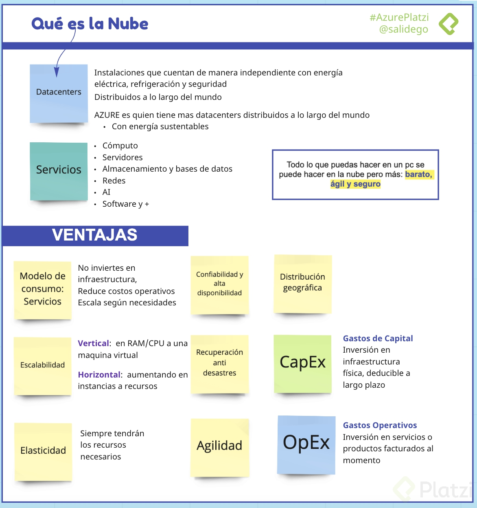

# Curso de Introducción a la Nube con Azure
Aprende Microsoft Azure para escalar tus proyectos en la nube con servicios de DevOps, machine learning, inteligencia artificial, Big Data y espacios de almacenamiento ilimitado. 

Descubre qué es el cloud computing y cuáles son sus ventajas contra el cómputo on-premise. Domina los conceptos esenciales para crear tu primer instancia de una máquina virtual y especializarte con Azure.

* Dar un vistazo general a todos los componentes de Microsoft Azure
* Comprender qué es y para qué sirve el cómputo en la nube
* Conocer los servicios de Azure para Cloud Computing
* Identificar los sistemas de Azure para Inteligencia Artificial y Big Data

## Qué es la nube: ventajas y características

## Modelos de servicio: IaaS, PaaS, SaaS y serverless

## Tipos de nube: pública, privada e híbrida
* Nube pública. 
    * Accesible a todo el mundo
    * Son propiedad de un proveedor
    * Se distribuye a través de internet
* Nube privada
    * Accesible solo para algunos miembros de la organización
    * Puede estar on-premise u hospedada. 
* Nube híbrida
    * Combinación de on-premise, nube pública y privada

## Qué es Azure
Es un proveedor de servicios en la nube, cuenta con mas de 100 servicios distintos para ser accedidos a través de internet. Cubre prácticamente cualquier necesidad para la nube o de computo.

Ventajas:

Preparado para el futuro
Crea a tu ritmo
Listo para cualquier tipo de nube
Confiable
Cuenta con plataforma Microsoft Learn
Como funciona Azure:

A través de la virtualización (se puede realizar de forma local o en la nube en un Datacenter).

Basado en virtualización abstrae los elementos de una PC recibidos por un Hypervisor.
Se usa un orquestador encargado de recibir nuestras indicaciones.

Cuenta con:
* Azure Portal
* Azure Marketplace

## Cuentas de Azure

* Recursos
    * Instancias de los servicios disponibles(máquinas virtuales, Discos duros, FaaS, Bases de datos)
* Grupos de recursos 
    * Contenedor lógico donde se implementan y administran recursos de Azure. Un recurso puede pertenecer a un solo GR pero puede comunicarse con recursos de otro GR.
* Suscripciones
    * Agrupación de cuentas de usuario y recursos creados por estas cuentas. Puede tener límites o cuotas definidas.
* Grupos de administración
    * Administran el acceso, las directivas y cumplimiento de las suscripciones. Las suscripciones heredan las condiciones de su grupo.